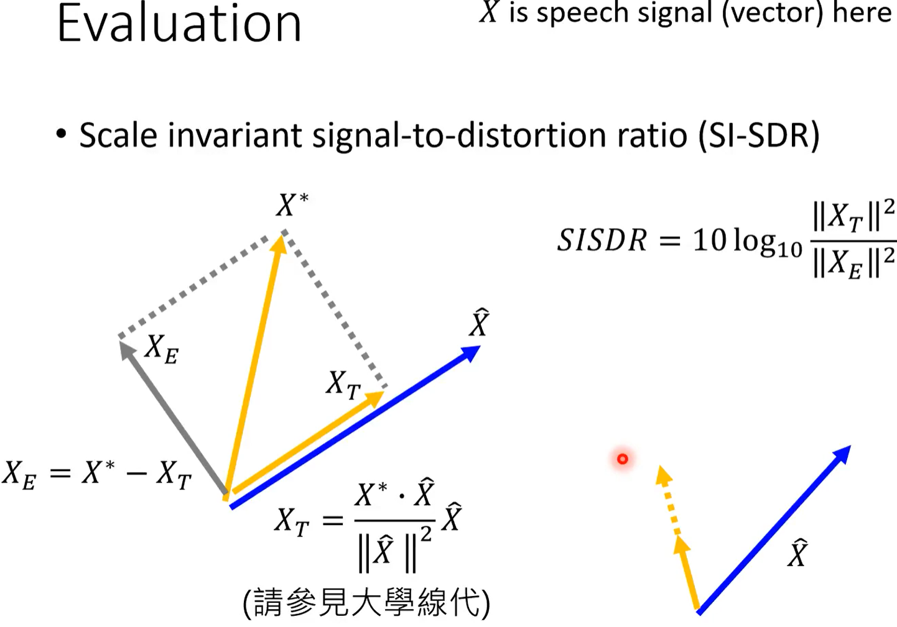
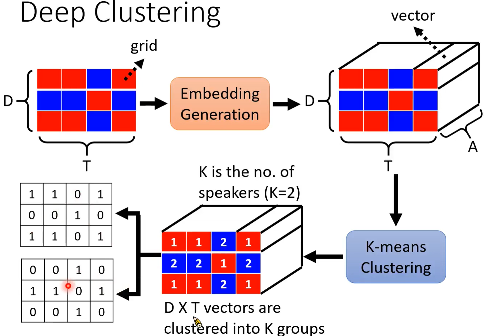
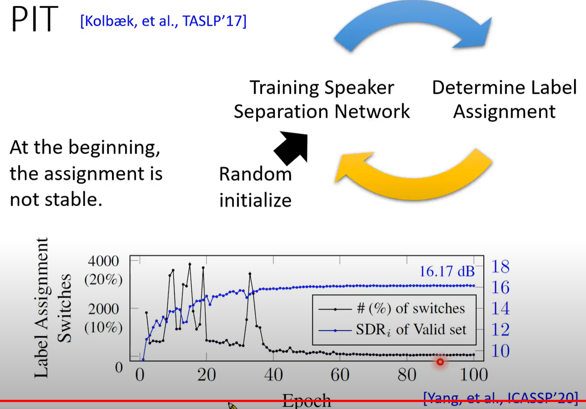
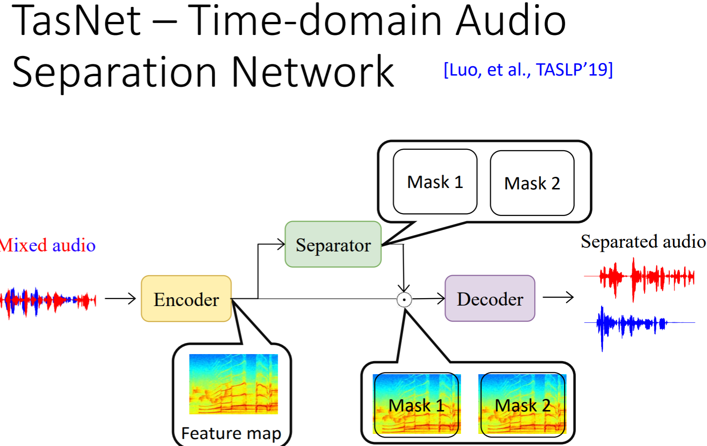
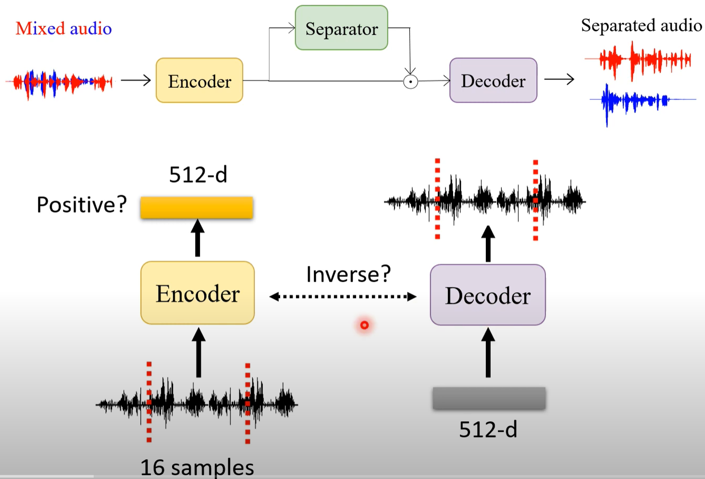
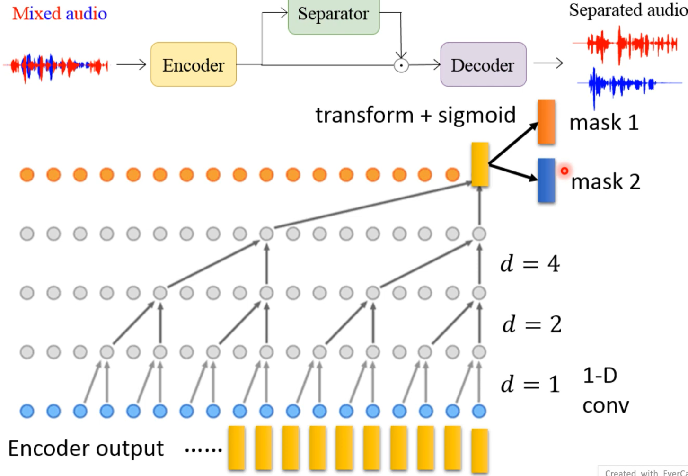
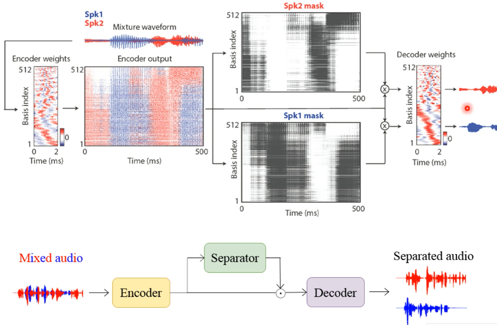

# [DLHLP 2020] Speech Separation - Deep Clustering, PIT, 

### Slices: http://speech.ee.ntu.edu.tw/~tlkagk/courses/DLHLP20/SP%20(v3).pdf
### Speech separation

* Human can focus on the voice produced by a single speaker in a crowded and noisy environment
* **Speech Enhancement**: Speech-nonspeech separation
* **Speaker Separation**: Multi-speaker talking
  * focusing on two speakers
  * focusing on single microphone
  * Speaker independent: training and testing speakers are completely different
    * input and output have the same length (no need for seq2seq model)
* dataset: add different speech signal together
*  Evaluation
   * Signal-to-noise ratio (SNR) bad $SNR=10log_{10}\frac{||\hat X||^2}{||\hat X-X^*||^2}$
   * scale invariant signal-to-distortion ratio (SI-SDR)
   * 
* Permutation Issue: 
  * e.g. the ouput order is not stable

### Deep clustering

* Matrix X --> Mask generation --> Matrix M1--> * -->matrix X1
  													 --> Matrix M2--> * -->matrixX2
* Spectrogram (D frequency dimension * T time) --> Embedding generation --> (D\*T\*A) --> K-means Clustering --> D*T vectors are clustered into K groups, K is # speakers --> get binary mask
* 
* Training: only **embedding generation** can be trained
  * the grids for different speakers are far away
  * the grids belonging to the same speakers are close to each other

### Permutation Invariant Training (PIT) [Kolbak, IASLP 17]

* Given a speaker separation model $\theta ^i$, we can determine the permutation
* 

### TasNet: Time-domain Audio Separation Network

* Input: mixed audio output: separated audio
* Consist: Encoder(feature map), Separator(mask1 & mask2), Decoder(inverse transform?)

* Encoder and decoder (not inverse)
* 
* Separator **WaveNet structure** mask sigmoid no need for sum = 1
* 
* Depthwise Separable Convolution (CNN Network reduction)
* LSTM -- overfit / Conv -- no such problem
* 

**SI-SDR and SDR improvements(dB) on WSJ0-2mix** --> separation

http://speech.ee.ntu.edu.tw/~tlkagk/courses/DLHLP20/SP%20(v3).pdf

### Unknown number of speaker

[Takahashi, et al., INTERSPEECH 19] -- 每次只分离出一个speaker

### Multiple Microphones

[Luo, et al., ASRU'19]

### Visual Information

### Task-oriented Optimization

* for human: Quality, intelligibility --> Optimizing STOI, PESQ non-differentialble [Fu, et al., ICML 19]
* for machine: ASR, Speaker Verification --> Optimizing system performance [shon, et al., INTERSPEECH 19] 
  

