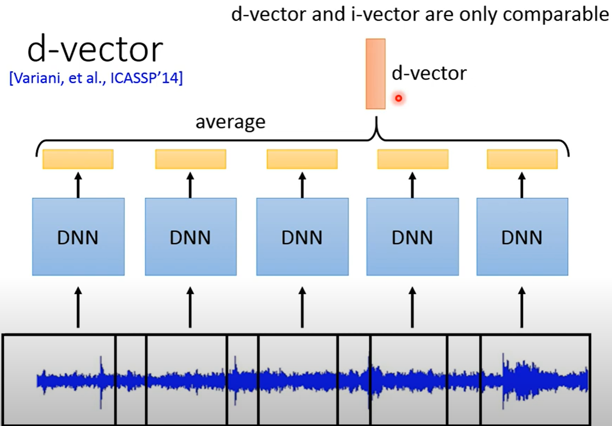

# [DLHLP 2020] Speaker Verification

### Slices: http://speech.ee.ntu.edu.tw/~tlkagk/courses/DLHLP20/Speaker%20(v3).pdf

speech --> class

* Related Tasks: emotion recognition
* Sound Event Detection
* **Autism Recognition**
* Keyword Spotting

* Speaker recognition / identification
* Speaker Verification: bank service
  * Equal error rate (EER)
* **Speaker Diarization**
  * Step1: segmentation
  * Step2: clustering
    *  the number of speakers can be known or unknown
  

### Speaker Embedding

* Framework

  * Stage 1: Development
  * Stage 2: Enrollment speaker embedding
  * Stage 3: Evaluation
  * training dataset in stage 1won't appear in testing stage 2&3
  * Metric-based meta learning

* Development: 

  * Benchmark corpus: 

  * 

  * i-vector: identity vector --non DNN

  * #### d-vector: average

    * 

  * #### x-vector: statistic pooling

    * 直接看整个句子
    * aggregate all vector

  * Attention Mechanism

  * NetVLAD: Vector of locally aggregated descriptors !!! [Xie, et al., ICASSP’19]

    

### End-to-end speaker verification

* Can we jointly learn speaker embedding and similarity computation
* 

* Text-independent / Text-dependent (discriminator & similarity)

Equal error rate: 取决于threshold
