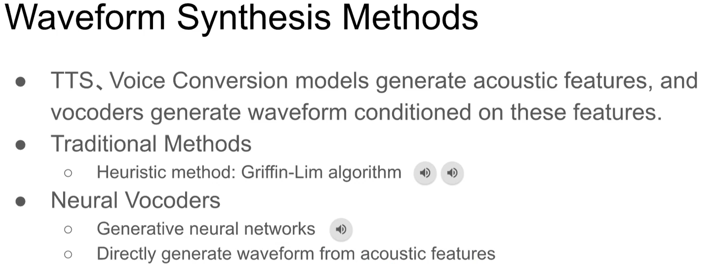
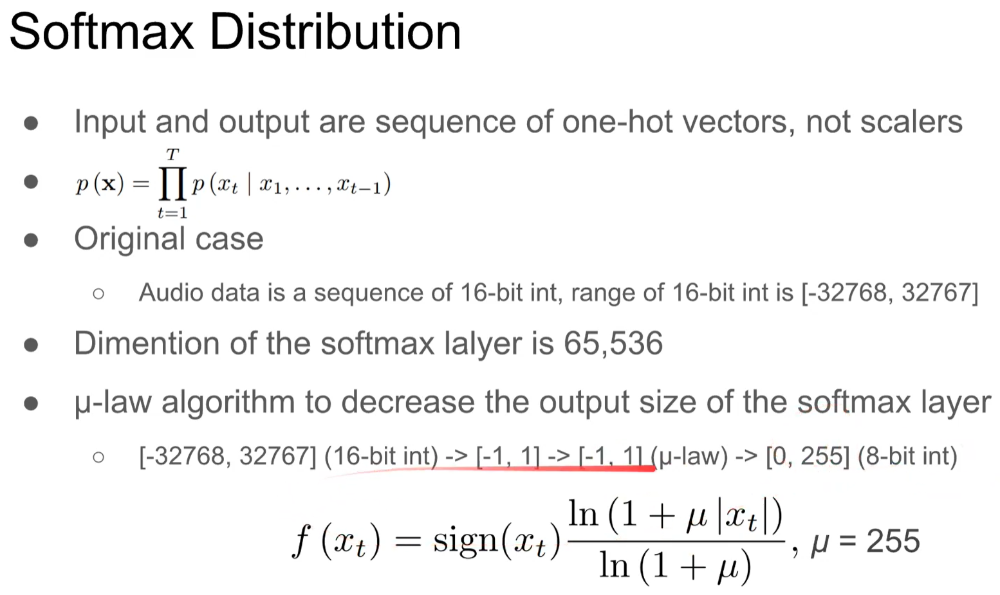
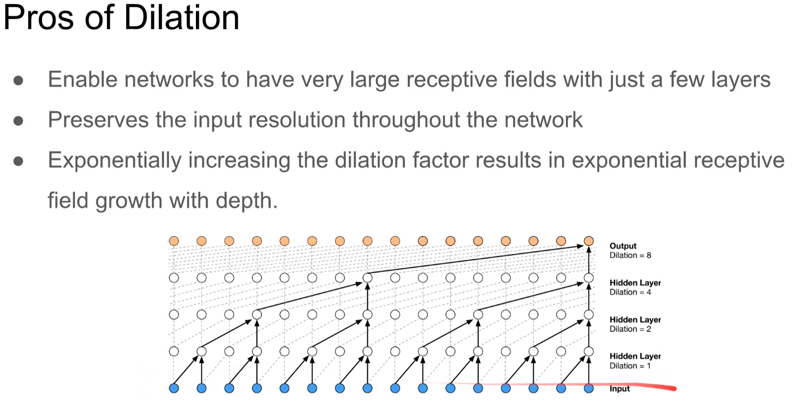
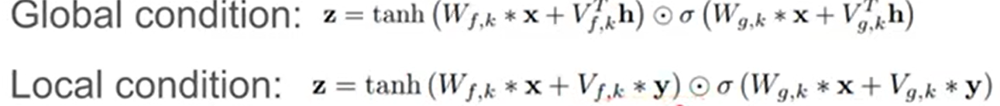
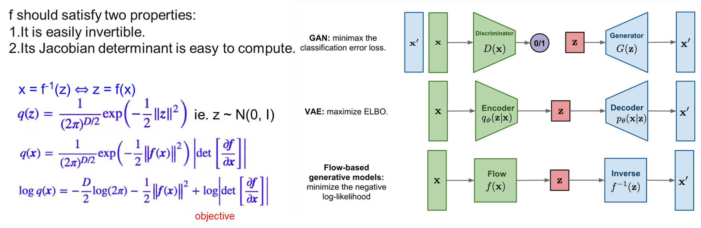

# [DLHLP 2020] Neural Vocoder

### Slices: https://docs.google.com/presentation/d/1HlX_RXu3mMnJSgcs9s7eV2roJLYRlw_nU9S0ayYlNpI/edit?usp=sharing
### Introduction

* Where did the distortion come from:
   $$
   STFT{x} = X(t,f) = A_{t,f^{e^{i\theta _{t,f}}}}
   $$
   where A is spectrogram, $\theta$ is phase
* How to transfer Spectrogram to Waveform
  * 
  * A well-trained vocoder can be used on different speech tasks

### Neural Vocoder

#### WaveNet: 

* Inspired by autoregressive model

* Input {x1, ......, xt-1} time series data, output: xt

* Causal convolutions: Main factor of the WaveNets

* Model:

* **Softmax distribution!** $\mu$-Law is better than linear mapping

  * 

* Casual Convolution 

* Dilated Convolution: expand receptive fields

  

* WaveNet with additional condition

* Spectrogram: local condition varying with time

* Global condition:

* Problem: Slow at inference time

#### FFTNET

* Contribution:
  * Propose a novel TTS model, FFTNet, which can generate audio much more quickly than the WaveNet
  * Show some training and synthesis techniques that can improve the audio quality of both WaveNet and FFTNet
* Model
  * 
* Techniques:
  * **Zero padding** training stable
    Padding zeros to the beginning of the audio when training.
  * **Conditional sampling**: output -- not most likely -- random sampling
  * **Injected noise**: 
    Inject Gaussian noise to the input x while training, the target remain clean.
  * **Post-synthesis denoising**
    Apply a spectral substraction noise reduction to voiced audio.
* Conclusion:
  * As the author said, FFTNET can generate results as good as WaveNet does at a faster speed (real-time using CPU).
  * Unfortunately, no one can reproduce the result...(but still faster than WaveNet)
  * Some training techniques to improve performance of auto-regressive model.

#### WaveRNN

* Dual softmax layer
* model:
* Speed Up:
  * Sparse WaveRNN
    * Weight Sparsification Method
    * Structured Sparsity
  * Subscale WaveRNN
    * Subscale dependency scheme
    * Batched sampling
  * Real-time on mobile CPU

#### WaveGlow -- no autoregression

* Flow-based model
* 
* Conclusion
  * With the flow-based architecture, WaveGlow can synthesize audio faster than real-time.
  * Problem: Extremely hard to train
    * Trained on 8 Nvidia GV100 GPUs in the origin paper.

### Conclusion

* Quality: WaveNet > others
* Training Speed: WaveRNN >= WaveNet >= FFTNet >> WaveGlow
* Inference Speed:
  * Real-time: 16kHz (sample rate 16000)
  * WaveGlow (520kHz) >> Real-time > WaveRNN >= FFTNet >> WaveNet (0.11kHz)
  * Highly optimized Griffin-Lim algorithm: 507kHz
* Neural vocoders are either slow or hard to train.
* Model needs to be highly optimized.
* A fast, high quality, and easy-to-train vocoder is an important future work.

