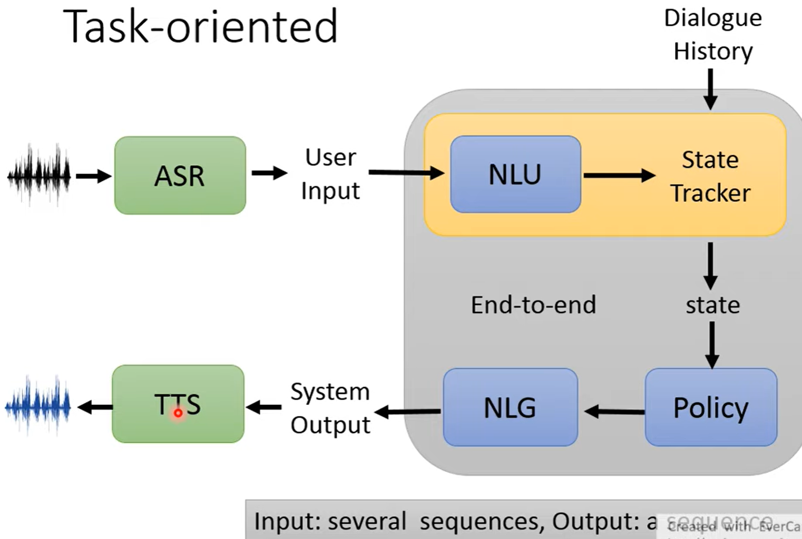

# [DLHLP 2020] Overview of NLP Tasks

Slices: http://speech.ee.ntu.edu.tw/~tlkagk/courses/DLHLP20/TaskShort%20(v9).pdf

NLP: text2text text2class

### Category: text2text text2class

* 8 types
* 

* Part-of-speech(POS) Tagging
  * Annotate each word in a sentence with a part-of-speech
* Word segmentation
  * for Chinese
* Parsing
  * Constituency parsing
  * Dependency parsing
* Coreference Resolution
  * 明确代词含义
* Summarization
  * Extractive summarization
  * Abstractive summarization
    * pointer network: Encouraging direct copy from input
* Machine translation
  * Unsupervised machine translation is a critical research direction
* Grammar Error Correction
* Sentiment classification
* Stance Detection (立场): Support, denying, Querying, Commenting
* Veracity Prediction
* (NLI)Natrural Language Inference: contradiction, entailment, neutral
  * Premise
  * hypothesis
* Search Engine
* Question Answering (QA): Watson
  * Reading comprehension
  * Input: several sequence output: one sequence
  * Extractive QA: answer in the document
* Dialogue
  * chatting
  * Task-oriented dialogue
    * Natural Language Generation (NLG)
    * Policy & State tracker: what has happened in this dialogue
    * Intent classification 
    * Slot filling
  * 

* Knowledge graph
  * entity: 东西 relation
  * Step 1: Extract Entity
  * Step 2: Extract Relation
  * Name Entity recognition (NER): people, organization, places ......
    * input: sequence output: class for each token
  * Relation Extraction
  * GLUE: General Language Understanding Evaluation
    * red: input sentence output: type one type
    * green: input: two sentence output: one class
    * blue: input premise and hypothesis output: one class
  * 
  * Super glue
  * DecaNLP: decathlon
    * 10 NLP tasks
    * solving by the same model
  

