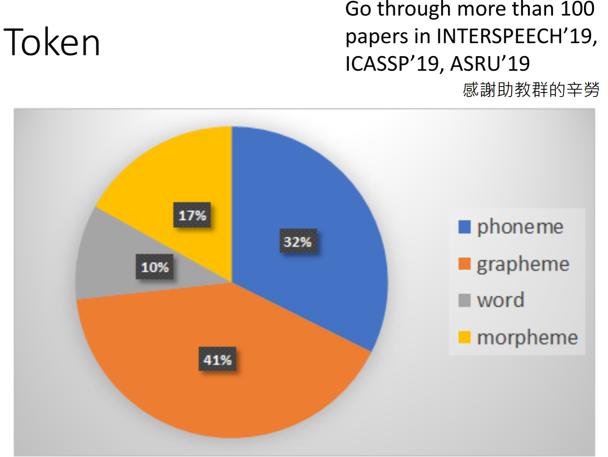
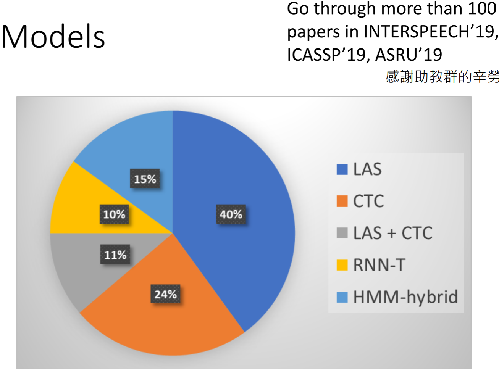

# [DLHLP 2020] Speech Recognition 1

## slices: http://speech.ee.ntu.edu.tw/~tlkagk/courses/DLHLP20/ASR%20(v12).pdf

J.R. Pierce -- propose speech recognition -- Bell Lab

### Input:

* Speech: a sequence of vector (length T, dimension d)
* Text: a sequence of token (length N, V tokens)

### Output: Token

* **Phoneme**: a unit of sound
  * Phoneme --> Lexicon (Record the relationship between word and phoneme) 
    -->transfer phoneme to Lexicon) 
* Grapheme: smallest unit of a writing system **(lexicon free!)**
  * V(token): 26 English alphabet + {space} + {punctuation marks}
* **Word** V>100K bad:(
* **Morpheme**: the smallest meaningful unit (grapheme<morpheme<word)
  * e.g. unbreakable --> un break able
* Bytes: the system can be language independent
  * UTF-8 is 256bit --> V is always 256bit
* 
* Slot filling: output possible slot

### Acoustic Feature

* Speech --> window(25ms) --> frame {400 sample points (16KHz) :( / 39-dim MFCC / 80-dim filter bank output} --> window moving right (hop size: 10ms)
* Acoustic feature: 
  * Waveform --[DFT]--> Spectrogram --[filter]--> filter band --[log]--> DCT --> MFCC

### Corpora

* TIMIT 4h -- MNIST

* WSJ 80h
* Switchboard 300h
* Librispeech  960h
* Fisher 2000h
* ISLVRC -- IMAGENET

### Model in two points of View

* Seq-to-Seq
  * LAS
  * CTC
  * RNN-T 
  * Neural Transducer
  * MnChA
* HMM
  * HMM-hybrid

