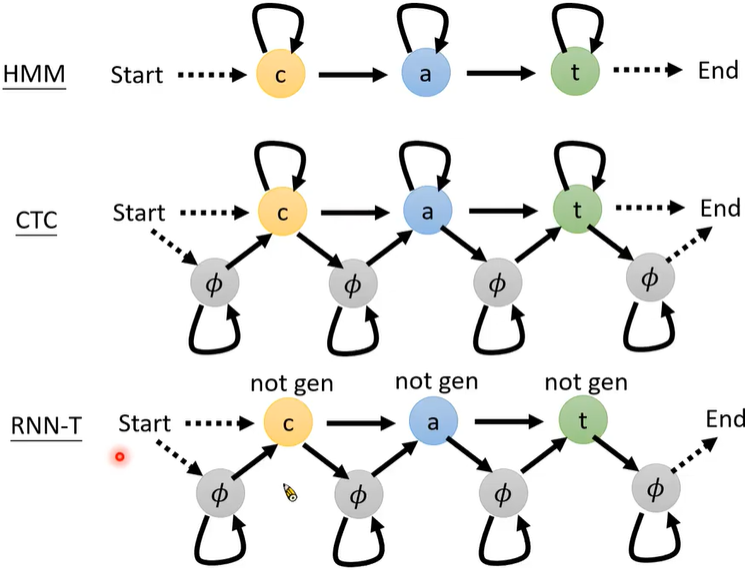

# [DLHLP 2020] Speech Recognition 5 - Alignment of HMM, CTC and RNN-T

### Slice: http://speech.ee.ntu.edu.tw/~tlkagk/courses/DLHLP20/ASR2%20(v6).pdf

**With a acoustic feature, the model can generate an end-to-end feature**

* LAS directly computes P(Y|X)
* 

* CTC, RNN-T
*  
* Enumerate all the possible alignments
* 
* HMM: Trellis Graph
* CTC
  * If there are the same letters, $\phi$ must be inserted between them

* RNN-T
  * The first output and the lase output must be $\phi$

