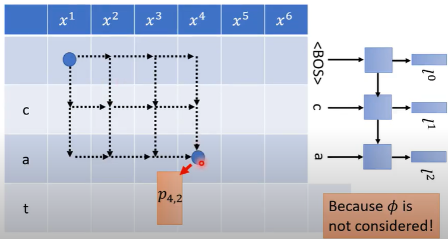

# [DLHLP 2020] Speech Recognition (6/7) - RNN-T Training (optional)

*** This lecture is difficult to understand, please review it later ***

### Slice: http://speech.ee.ntu.edu.tw/~tlkagk/courses/DLHLP20/ASR2%20(v6).pdf
### How to sum over all the alignments

The distribution in one square is not affected by the path of getting to this grid (格子的distribution不受到如何走到这个格子路径的影响)

* How to calculate the sum of all alignments? (如何计算所有alignment总和？)

dynamic programing 

We can only calculate the results of alignment after getting the parameters of RNN-T. (先有RNN-T的参数才能计算alignment的结果)

* training:
*  $\alpha_{i,j}$ is the summation of the scores of all the alignments that read i-th acoustic features and output j-th tokens
* $\beta_{i,j}$ is the summation of the score of all the alignments starting from i-th acoustic features and j-th tokens

