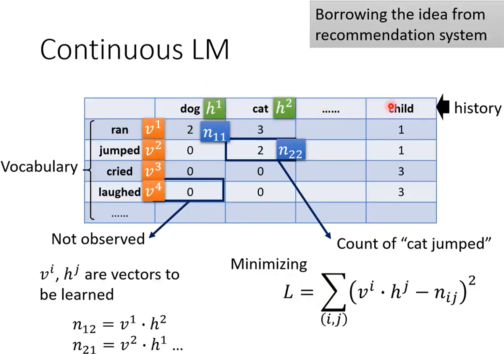
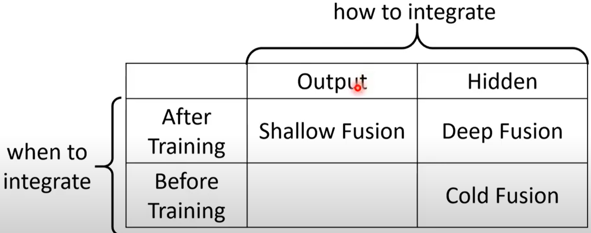
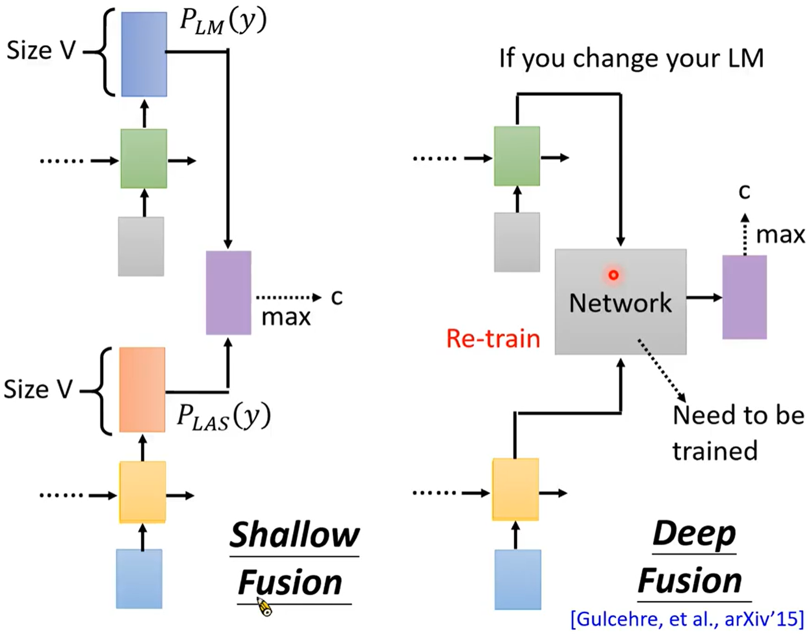
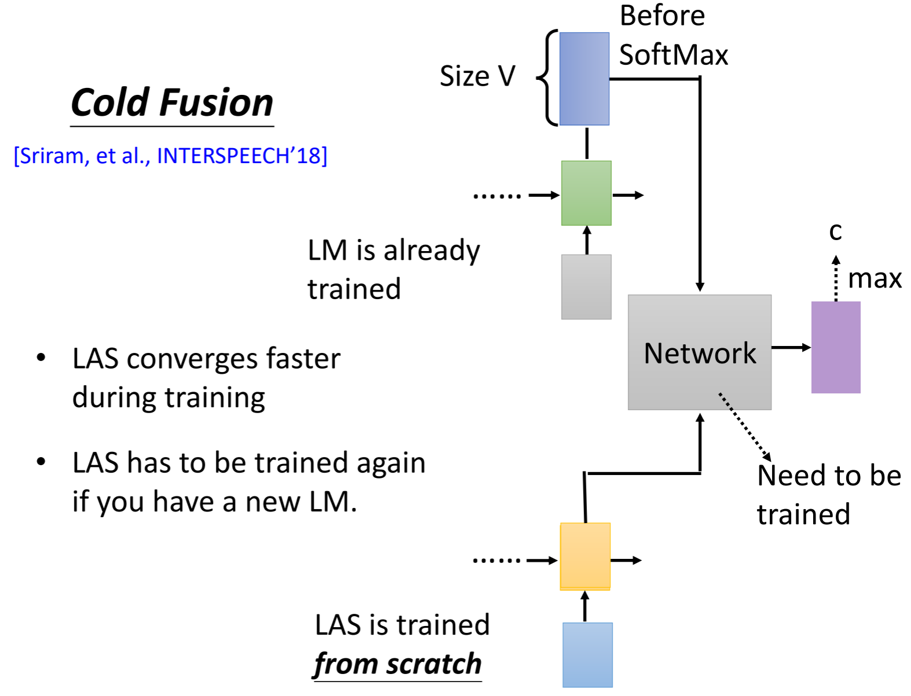

# [DLHLP 2020] Speech Recognition (7/7) - Language Modeling

### Slices: http://speech.ee.ntu.edu.tw/~tlkagk/courses/DLHLP20/ASR3.pdf
### Why language model?

* Language model: Estimated the probability of token sequence

  * token sequence: Y = y1,y2,......,yn
  * P(y1,y2......yn)
  * HMM:   $Y^*=arg maxP(X|Y)P(Y)$
  * LAS: seems no need for language model: $Y^*=argmaxP(Y|X)$ (*P(Y))
    * where P(Y|X) --> need paired data
    * P(Y) --> easy to collect
    * If the output is text, it's useful to add language model (P(Y)). (如果输出是文字，加上language model P(Y)往往有用)
  * BERT: 30 
  * why we need LM? P(Y|X) needs paired data, P(Y) is easy to train.(Lots of data)

* N-gram model (LM)

  * How to estimate P(y1,y2,……,yn)
  * Collect large text data as training data
    * no all kinds of sequence appear in the training data
  * N-gram language model: P(y1,y2,……,yn) = P(y1|BOS)P(y2|y1)...P(yn|yn-1) 拆分概率
  * Challenge of N-gram
    * The estimated probability is not accurate, especially when we consider n-gram with large n
    * Because of data sparsity (many n-grams never appear in training data)

* Continuous LM

  * Recommendation system
    * Matrix Factorization
    * for each token there is a vector
    * nij: The number of occurrences (出现次数)

  

* NN-based LM: Learn to predict the next word

* RNN-based LM
  * If we use 1-of-N encoding to represent the history, history cannot be very long
  
    --> So we use RNN-based LM

### How to use LM to improve LAS?

* shallow fusion: fuse the outout of LAS and the output of LM
* deep fusion: Cannot change the language model arbitrarily, unless you change the domain (不能任意换language model，除非换domain的时候)
* 

* cold fusion: LAS and LM co-training, cannot change language model

