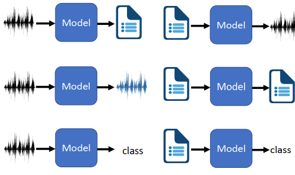
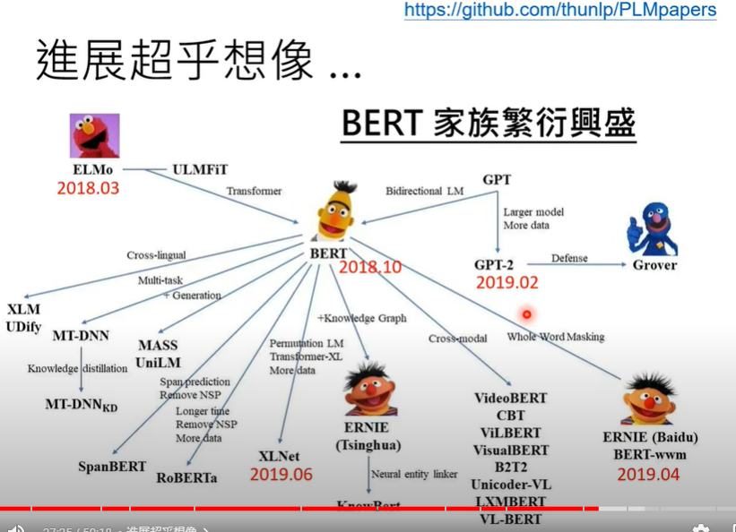

# [DLHLP 2020] Deep Learning for Human Language Processing (Course Overview)

* Natural language processing:

  * Natural language: text &  speech

* Human language 

  * Speech: 1 second has 16K sample points (16K number in 1 second)
  * Text: "the language instinct: How the mind creates language"

* Model

  * 6 types small change

  * 

  * Speech --> text  automatic speech recognition :ASR

  * Text --> Speech **Keiichi ToKuda** interspeech 19 TTS is end-to-end

  * speech --> speech speech separation: (cocktail party effect) 
    Voice conversion: Only one utterance from each speaker (one-shot learning  )

  * audio --> class keyword spotting

  * text-->text text generation (translation, summarization , chat-bot, **question answering**, syntactic parsing)

  * 

    Turing NLG

* Meta learning  = learn to learn
* Learning from Unpaired Data
* Knowledge Graph
* Adversarial Attack
* Explainable AI

